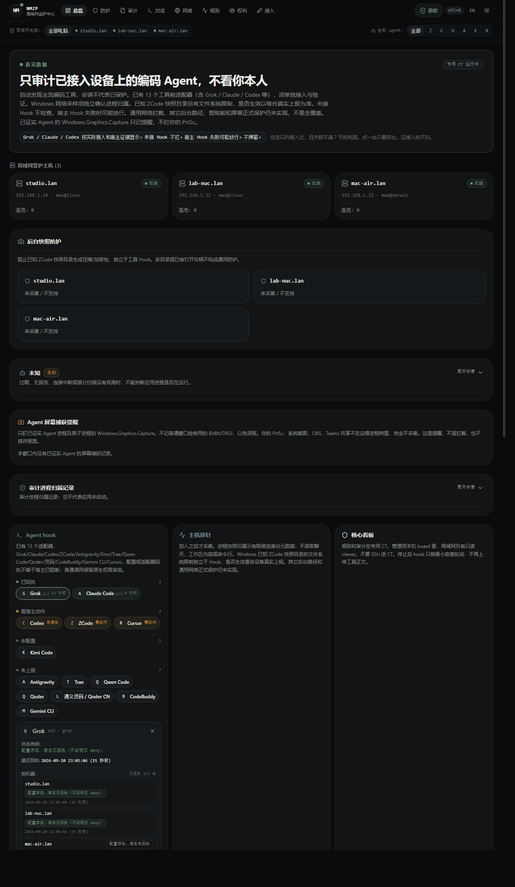

<p align="center">
  
</p>

<h1 align="center">NMZP Monitor</h1>

<p align="center">
  LAN coding-agent guard
  <br>
  <sub>Every tool call is evaluated before it runs: high-risk blocked, privacy tokens rewritten, the rest logged.<br>Only coding agents on joined hosts. Not you. No chat transcripts.</sub>
</p>

<p align="center">
  <a href="README.md">中文</a>
  &nbsp;·&nbsp;
  <strong>English</strong>
</p>

<p align="center">
  
  
  
</p>

<p align="center">
  
</p>

A dedicated CT runs the core. Guarded PCs run a probe. The core is Node's own HTTPS with a pinned self-signed cert on the device — **no root CA is installed into the OS**. Licensed [MIT](LICENSE): fork, build, rewrite.

> Let an agent deploy it for you. Then it already knows why some of its own actions get blocked.

---

## Supported agents

13 official PreToolUse adapters. `join` writes config **only where the host directory already exists**. It does not invent files for products you never installed.

Every adapter does the same thing: send the tool call to the rule engine before it runs → block / rewrite arguments / allow-and-log → write a local receipt `hook-status.json` → report to the CT board. They differ only in each host's exit codes, JSON keys, and deny semantics.

| Agent | Config written on join | Block | Rewrite | Log | Extra |
| --- | --- | :---: | :---: | :---: | --- |
| **Grok** | `~/.grok/hooks/nmzp.json` | ✅ | ✅ | ✅ | Official fail-open |
| **Claude Code** | `~/.claude/settings.json` | ✅ | ✅ | ✅ | Official fail-open |
| **Codex** | `~/.codex/hooks.json` | ✅ | ✅ | ✅ | Must be trusted in-host via `/hooks`; NMZP does not write the trust table |
| **ZCode** | `~/.zcode/cli/config.json` | ✅ | ✅ | ✅ | Turns on `hooks.enabled`; takes effect on a **new session** |
| **Antigravity** | `~/.gemini/config/hooks.json` | ✅ | ⚠️ becomes ask | ✅ | **Restart the IDE**; public reports of hooks not firing on Windows |
| **Gemini CLI** | `~/.gemini/settings.json` | ✅ | ✅ | ✅ | Hangs on `BeforeTool`; needs a working account |
| **Cursor** | `~/.cursor/hooks.json` | ✅ | ⚠️ becomes ask | ✅ | Pass-through needs explicit `permission: allow`; 2.1.x has non-firing reports |
| **Kimi Code** | `~/.kimi-code/config.toml` | ✅ | ❌ rewrite = deny | ✅ | Block/line TOML split, not a full parser |
| **Trae** | `~/.trae/hooks.json`, `~/.trae-cn/` | ✅ | ✅ | ✅ | Imports Claude config; duplicate reports are suppressed |
| **Qwen Code** | `~/.qwen/settings.json` | ✅ | ✅ | ✅ | — |
| **Qoder** | `~/.qoder/settings.json` | ✅ | ✅ | ✅ | — |
| **Lingma** | `~/.lingma/`, `~/.qoder-cn/` | ✅ | ✅ | ✅ | — |
| **CodeBuddy** | `~/.codebuddy/settings.json` | ✅ | ✅ | ✅ | Rewrite key is `modifiedInput` |

---

## Install

### 1. Pack

On a machine you trust:

```bash
npm ci && npm test && npm run build && npm run pack
```

That produces `nmzp-core.tgz`.

### 2. Core onto a dedicated CT

Extract to `/opt/nmzp` and start with the existing `nmzp` user and systemd ([details](#ct-install)). No computer is watched yet.

### 3. Issue a join bundle

```bash
runuser -u nmzp -- env NMZP_DATA=/var/lib/nmzp NMZP_PUBLIC_URL=https://<CT-IP>:8787 \
  node /opt/nmzp/nmzp.mjs ticket --out /var/lib/nmzp/join-bundle.json
```

Copy `join-bundle.json` and `admin.token` **as files** to the admin PC. USB or a local folder is fine. Do not paste them into chat or a URL.

### 4. Join each guarded PC

```powershell
.\nmzp.cmd join .\join-bundle.json
```

Success prints the device id and autostart kind, never the token. Join writes host config only for directories that already exist.

> **One required step after join:** fully quit and reopen any running desktop host (ZCode / Antigravity / Cursor / Trae / …) or the new hook will not load. Codex must also trust `NMZP PreToolUse v1` via `/hooks` inside the host.

### 5. Board

Admin (can change policy; local only):

```powershell
.\nmzp.cmd board --bundle join-bundle.json --token-file admin.token
```

Open `http://127.0.0.1:8788` and pick the token file. The token never goes into the URL or localStorage.

Everyone else on the LAN opens `http://<CT-IP>:8789` for a redacted overview. **Read-only. Cannot change rules.**

### 6. Temporary stop / uninstall on the PC

Use NMZP's own commands. Do not ask an agent to `pkill` / `Stop-Process` — self-protection will block that.

A temporary stop kills the probe only. **Hooks stay.** Tool calls are still evaluated, and Startup will relaunch the probe at next logon. To stop blocking, uninstall, then fully quit and reopen desktop hosts.

`nmzp rights stop` pauses policy on the CT. It does not stop the local process.

```bat
.\nmzp.cmd stop
.\nmzp.cmd uninstall
```

`uninstall` is the same as `leave`: stop the probe, remove NMZP autostart, strip only NMZP-owned hooks. If you cannot find the unpacked tree:

```bat
for /d %I in ("%USERPROFILE%\.nmzp\runtime\*") do "%I\nmzp.cmd" uninstall
```

To start the probe again:

```bat
wscript //nologo "%APPDATA%\Microsoft\Windows\Start Menu\Programs\Startup\NMZP-probe.vbs"
```

If you ever ran `nmzp snapshot apply`, quit ZCode first, then `.\nmzp.cmd snapshot restore` before uninstall. `uninstall` / `leave` do not undo that directory ACL. If `nmzp board` is still open locally, close that window.

The probe is a hidden Startup `NMZP-probe.vbs`. **No console window needs to stay open.** The LAN board is a systemd unit on the CT. Only the local 8788 admin page needs `nmzp board` running.

| File | Where | What |
| --- | --- | --- |
| `admin.token` | CT `/var/lib/nmzp/`, copy to the admin PC | Local board login. **Not in git, not in chat.** |
| `join-bundle.json` | Issued on the CT | Device join; contains a one-time ticket |
| `credentials.json` | Guarded PC `%USERPROFILE%\.nmzp\` | Probe heartbeat credentials, **not** the admin token |
| `hook-status.json` | Guarded PC `%USERPROFILE%\.nmzp\` | Whether the host actually invoked NMZP |

---

## What it does

### Block and rewrite

| Feature | Default | Notes |
| --- | --- | --- |
| Built-in rule engine | **Enforcing** (UI label: Quiet) | 75 rules: 33 block, 41 log, 1 rewrite |
| Forced high-risk block | On, **cannot be relaxed** | exfil / tamper / isolate / poison / secret always block in enforcing; 26 rules, board and import cannot downgrade them |
| Per-rule override | 8 rules raised to block | Set any unprotected rule to block / log / off; per-rule > threat family > built-in default |
| Threat-family override | Off | One click to block or log all of `destructive` (rm -rf / dd / DROP / force push…) or `recon` |
| Exemptions | Add your own | Audit row → “false positive” → `rule + hit text + tool`, 30-day expiry; protected rules cannot be exempted |
| Project privacy rewrite | 9 suggested | Up to 64, compiled locally; matched tokens **never reach the model**; tool/field scope and dry-run |
| Custom block phrases | Add your own | `db.prod.internal \| block` on outbound; `Bash,url: …` prefixes scope it |
| Three policy modes | Enforcing | Enforcing (table applies) / observe (log everything) / off (allow all). Overrides and exemptions apply only in enforcing |
| Silent pause | Off | While paused, hooks poll policy only and do not upload tool bodies |

The eight rules raised to block by default: writing SSH authorized_keys, disabling security tooling, adding/removing system users, C2 frameworks, reading browser passwords, fork bombs, recursive 777, setuid bits. Everyday sudo / pip / npm -g / docker / force push / DROP stay log-only until you flip them on the rules page.

**Overrides apply only in enforcing. Saving policy ≠ the device has synced ≠ the host actually denied.** Each row on the rules page shows all three.

### Observe and evidence

| Feature | Default | Notes |
| --- | --- | --- |
| Audit ring | On | Up to 2000 rows: risk, decision, layer, session |
| Tool-call log | On | Hooked **tool calls** only, not chat transcripts |
| TCP peer observe | On | Metadata for confirmed agent processes only |
| OSS/COS observe | On | **Warn, do not block** (not a firewall) |
| Archive size warn | 200 MiB / warn | Threshold 1–1048576 MiB |
| GitHub upload allowlist | Allowlist mode | “Unlimited” skips the list and the size warn |
| Agent discovery | On | Windows desktop/CLI/extension metadata; ambiguous hits are not auto-trusted |
| Hook receipt coverage | On | Fleet “N/M hosts have a receipt” plus per-machine detail |

### Local-only (the remote board cannot change these)

| Feature | Default | Notes |
| --- | --- | --- |
| ZCode checkpoints NTFS tripwire | **Off** (manual apply) | Only `~/.zcode/v2/checkpoints`; `nmzp snapshot apply\|restore` |
| Discovery path extras | Off | Admin adds absolute local paths; not uploaded to CT/LAN; does not launch anything |
| Network-owner grant | Off | `nmzp network-owner approve`; a discovered PID is never a trusted identity by itself |

### Export audit JSON for an AI

Top-right on the audit page: “Export JSON”. That is the **current filter** (high-risk / blocked / threat / OSS-high first if you want), plus evidence fields, the time window, and `policyContext` (current overrides / exemptions / privacy phrases, the 75-rule catalog, the protected-rule list, limits).

Four steps: **export → have an AI emit `nmzp-policy-proposal/1` JSON → “Import proposal” preview → apply**. “Copy AI prompt” already says: this schema only, no protected-rule edits, no `mode`, new rules default to dry-run.

Preview **replays** history: overrides are exact (rule id), privacy and exemptions are estimated from redacted summaries and marked as estimates. Any downgrade of a protected rule, or any `mode / stopped / github / archive` field, rejects the whole pack. Apply is an ordinary policy save; the server validates again.

> Glance at the export first. It contains your project commands and paths (privacy phrases themselves are masked on the read-only viewer export). Do not send it to a service that should not see that.

---

## What it does not do

`production_ready=false`. This is not a roadmap. It is a list of things **not to expect**.

| Not done | Why |
| --- | --- |
| **Screen-capture alerts** | Built, then removed. ETW on `Windows.Graphics.Capture` needs admin; as a normal user it burns CPU every 30s and still sees nothing, and it false-hits your own screenshots. |
| **Block oversize archives** | The board “block” option is `disabled`. Size is only visible when a command spells out a single archive — a partial block is more dangerous than none. |
| **Per-agent rule scope** | The agent id on a hook is self-reported and untrusted. Scope is tool and field only. |
| **Block GitHub / OSS / COS uploads** | Observe only. Cutting the network is a firewall's job, not a hook pretending to be one. |
| **Generic upload blocking** | Same. |
| **Clipboard / screenshot isolation** | Breaks normal work and is too easy to bypass. |
| **WFP kernel network filter** | Experimental; not in the ordinary pack. |
| **Full chat transcripts** | Deliberately not. Does not read `grok.db` / Claude projects / Codex sessions. |
| **In-memory pack / relocated dir / pipes / custom domains** | The ZCode directory tripwire does not cover these. No pretend. |
| **Stop a local administrator** | Admin / SYSTEM / the owner can undo the DACL. A tripwire, not a cage. |
| **Audit integrity, durable receipt retry** | Not built. Receipts during an outage are lost. |

---

## Boundary: discovery ≠ hook ≠ blocked

An agent name in the top bar means the PC **found an install or a process**. The board paints “receipt” only when `hook-status.json` has a fresh receipt. **Unconfigured, untrusted, or no receipt is never drawn as protected.**

An adapter being invoked is not the host actually executing deny. Fail-open policies differ; a crashed hook is a pass on most hosts.

Shipping a new adapter pack: `npm run pack` → `join` again on each PC → fully quit and reopen desktop hosts → fire one tool call and check the receipt. **A probe that did not re-join is still the old pack.**

---

## Stopping silent ZCode packing

Two **independent** mechanisms. Do not mix them:

1. **Hook (pre-tool):** after join writes `~/.zcode/cli/config.json`, a **new** session runs `nmzp hook --agent zcode`. No join, no restart: `ZCode.exe` can be running with no receipt.
2. **NTFS tripwire (directory):** aimed at older “pack checkpoints and push to OSS”. Does not depend on the hook.

Tripwire limits:

- Only `~/.zcode/v2/checkpoints`; commands `nmzp snapshot status|apply|restore`
- apply/restore refuse while ZCode is running — quit the client first
- Does not take over ACLs you already set elsewhere; admin / SYSTEM / owner can still undo
- Does not stop in-memory packing, a relocated directory, pipes, or a custom domain
- ZCode 3.14.0 removed the upload pipeline; this is a tripwire for leftover 3.12.3-style clients, **not “every version is still exfilling”**
- The `zcode.z.ai` **docs page** is not exfil; `/v2/oss-credentials` is still blocked
- `rights stop` does not undo this ACL; only `nmzp snapshot restore` does

---

<a id="ct-install"></a>

## Install on a dedicated CT (no Docker)

The CT has no SSH. The host copies the pack with `pct exec` into `/opt/nmzp`. Node is `/usr/local/bin/node`, system user `nmzp`, data `/var/lib/nmzp`.

```bash
tar -C /opt -xzf nmzp-core.tgz
install -m 644 /opt/nmzp/nmzp.service /etc/systemd/system/nmzp.service
# If the cert SAN needs the CT LAN IP:
# mkdir -p /etc/systemd/system/nmzp.service.d
# echo -e '[Service]\nEnvironment=NMZP_TLS_HOSTS=192.168.x.x\nEnvironment=NMZP_PUBLIC_URL=https://192.168.x.x:8787' > /etc/systemd/system/nmzp.service.d/override.conf
systemctl daemon-reload
systemctl enable --now nmzp
```

`GET /health` returns `{ok,name,version}` only. **That is not proof of protection.**

ticket / status / rules must use the same user and data dir as the running service: `runuser -u nmzp`, `NMZP_DATA=/var/lib/nmzp`. Do not let root create a second instance under `~/.nmzp/ct-data`.

### Read-only LAN viewer

```bash
install -d -m 755 /etc/nmzp
cat >/etc/nmzp/viewer.env <<'EOF'
NMZP_VIEWER_HOST=<CT-LAN-IPv4>
NMZP_VIEWER_PORT=8789
NMZP_VIEWER_ALLOW_CIDR=<LAN CIDR, e.g. 192.168.x.0/24>
EOF
chmod 600 /etc/nmzp/viewer.env
install -m 644 /opt/nmzp/nmzp-viewer.service /etc/systemd/system/nmzp-viewer.service
systemctl daemon-reload
systemctl enable --now nmzp-viewer
```

Equivalent to `nmzp viewer --host <private-ip> --port 8789 --allow-cidr <CIDR>`. Only source IPs inside allow-cidr pass. POST/PUT/PATCH/DELETE and `/api/v1/session`, `/policy`, `/evaluate`, `/join`, `/receipt` are rejected even with an admin token.

### Three ports

| Role | Address | Token |
| --- | --- | --- |
| Core TLS | `https://<CT-IP>:8787` | Device credentials / admin token |
| Local admin board | `http://127.0.0.1:8788` | Required; pick the token file |
| LAN read-only | `http://<CT-IP>:8789` | None, and it cannot change policy |

Do not SSH into the CT for day-to-day admin.

---

## Develop

```bash
npm ci
npm test
npm run typecheck
npm run build
npm run dev
```

`npm test` runs every `*.test.ts` in the tree (except `node_modules` / `dist`). Adapter wire format is defined by `core/hook-protocol.ts` and `core/host-adapters.ts` plus their tests.

---

## License

[MIT](LICENSE). Fork, build, rewrite.

<sub>Adapter mapping by FABLE · core by ASTRA · implementation by Grok · UI by Gemini.</sub>
