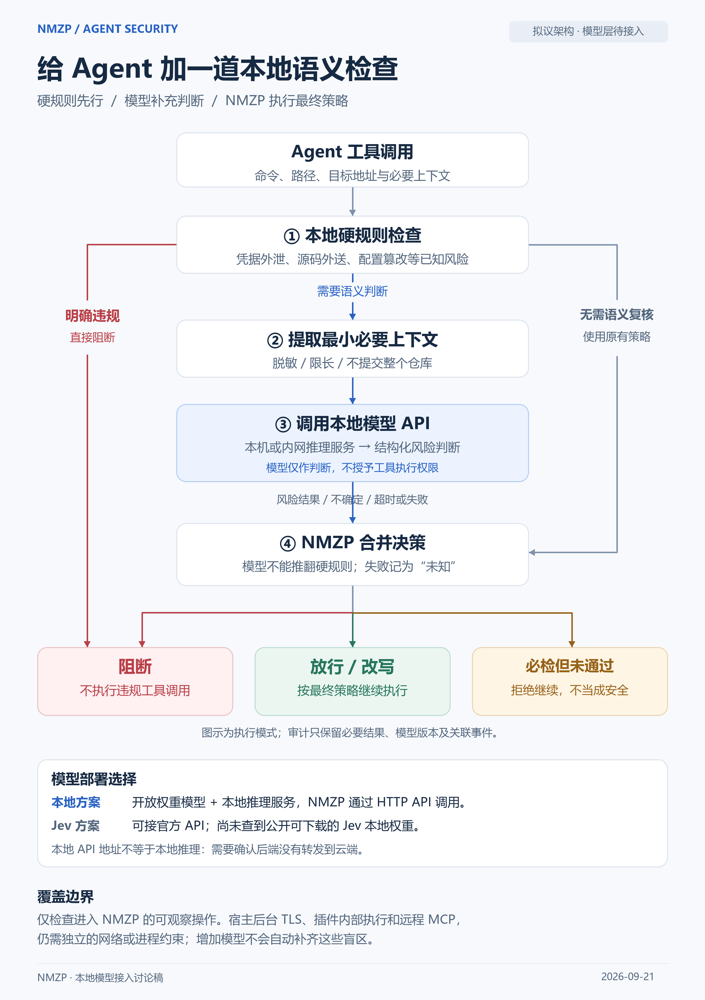

# 本地语义检查（规划中）

**规划中 / 模型层尚未接入。**

下面这张图是 2026-09-21 的架构讨论稿，不是当前产品的运行证明。NMZP 今天的判断来自本地硬规则、策略档位和 hook。仓库里没有「提取最小上下文 → 调用本地模型 → 把模型结果并进阻断」这条链路，本轮也不启用它。

英文说明在文末。

  

图中已经印着「拟议架构 · 模型层待接入」。这里再用文字写一遍，避免只靠图片传达状态。

## 图里提议、代码里还没有的部分

| 步骤 | 图中的意思 | 当前仓库 |
| --- | --- | --- |
| 1. 本地硬规则 | 外泄、源码外送、配置篡改等已知模式可以直接阻断 | 已有。见 `src/lib/monitor/rules.ts` 和 [SECURITY.md](../../SECURITY.md) |
| 2. 提取最小必要上下文 | 脱敏、限长，不提交整个仓库 | 未实现 |
| 3. 调用本地模型 API | 模型只做判断，不授予工具执行权 | 未实现。不接本地推理，也不接 Jev |
| 4. 合并决策 | 模型不能推翻硬规则；失败、超时、不确定记为「未知」，不当成安全 | 未实现 |

「无需语义复核、沿用原策略」描述的是这条规划里的短路，不是一块已经上线的开关。

## 图中的部署说明，按规划引用

- 本地方案：开放权重模型加本地推理服务，NMZP 通过 HTTP API 调用。尚未实现。
- Jev 方案：图中写「可接官方 API；尚未查到公开可下载的 Jev 本地权重」。这是图上的注记。本仓库没有核验这项外部事实，也没有接入该方案。
- 本地 API 地址不等于推理发生在本机。接入前需要确认请求没有被转到云端。现在没有这条调用，所以也不存在这条确认。

## 覆盖边界

即便按图接上模型，也只检查进入 NMZP 的可观察操作。宿主后台 TLS、插件内部执行和远程 MCP，仍要靠网络或进程约束。模型不会自动补上这些盲区。这条边界对今天的硬规则同样成立：hook 看不见的调用，规则也看不见。

## 明确不做的解读

- 不把本图写成已经具备的能力。
- 不把「未知」画成放行。
- 不把模型输出当成可以降级那 29 条受保护规则的依据。
- 审计若将来记录模型结果，图中要求只保留必要结果、模型版本和关联事件。该字段现在不存在。

[返回中文首页](../../README.md) · [English](../../README.en.md)

---

# Local semantic check (planned)

**Planned / the model layer is not connected.**

The figure above is a design discussion from 2026-09-21. It is not a screenshot of the running product. Today NMZP decides with local hard rules, the policy mode, and the host hook. This repository does not extract a minimal context, call a local model, or merge a model score into block or allow. This round does not turn that path on.

Steps 2–4 in the figure are unimplemented. Hard rules in step 1 exist. A model must not override those rules, and a failure must be recorded as unknown rather than safe. Those are design constraints for a future change, not current behavior.

A local API address would not, by itself, prove that inference stays on the machine. The note in the figure about Jev weights is the figure's own note. This repository has not verified that external claim and does not integrate Jev.

Coverage stays limited to operations NMZP can actually see. Host TLS, in-plugin execution, and remote MCP stay outside the hook. A future model would not close those gaps automatically.
